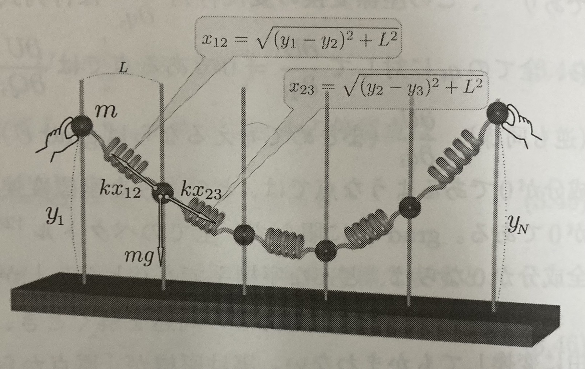

# 解析力学

## 変分

変分とは、ある量$A$を変化させたときに、その量に依存して決まる別の量$F(A)$がどのように変化するかを計算することである。つまり以下の式で表される。
$$
δF(A) = F(A + δA) - F(A)
$$
ここでもし$A$と$F(A)$が数値であれば、$δA$が十分に小さいとき、
$$
δF(A) = F'(A) δA
$$
となるため、微分と同じような役割を果たす。しかし、変分は$A$が関数である場合なども考えることができる。よって微分より広い概念である。

## 静力学

静力学（statics）とは、平衡状態の物体に作用する力やモーメントを求める力学のことである。静力学は力のつり合いを考えることで解析することができる。

## 力のつり合い

系に作用する力の合計及びモーメントの合計がゼロであるとき、系は静力学的平衡にあるという。これを力のつり合いという。
$$
\sum \bold{F}_i = 0 \\
\sum \bold{F}_i \times \bold{r}_i = 0
$$

## 仮想仕事の原理

力が釣りあっている場合、実際に起こりうる仮想変位$δ\bold{r}_i$を与えたとき、系に働く力の仕事の合計はゼロであるという原理である。式にすると以下になる。
$$
\sum \bold{F}_i \cdot δ\bold{r}_i = 0 \leftrightarrow \sum \bold{F}_i =0 , \quad \sum \bold{F}_i \times \bold{r}_i = 0
$$

仮想仕事の場合、内力の仕事の合計が0となるため最初から考察の対象から除外できるという利点がある。

## 例題1

以下の例を考えよう。滑車と重り二つを系と見れば、外力は地球との相互作用である重力($m_1g、m_2g$)のみである。よって、仮想仕事の原理より、$m_1$の仮想変位を$δ\bold{r}_1$、$m_2$の仮想変位を$δ\bold{r}_2$とすると
$$
m_1g \cdot δ\bold{r}_1 + m_2g \cdot δ\bold{r}_2 = 0
$$
ここで、実際に起こりうる仮想変位は、$-2δ\bold{r}_1 = δ\bold{r}_2$である。よって代入して
$$
m_1g \cdot δ\bold{r}_1 - 2m_1g \cdot δ\bold{r}_1 = 0
$$
より
$$
m_1 = 2m_2
$$
となる。

## 位置エネルギーと仮想仕事の原理

位置エネルギーの変分を考えてみよう。なお、位置エネルギーが定義できない状態(ベクトル場$\vec A$に対して、$rot \vec A \neq 0$)は考えないことにする。
$$
\begin{align*}
δU &= U(\bold{r} + δ\bold{r}) - U(\bold{r})\\\\
&= grad U \cdot δ\bold{r}\\\\
&= -\bold{F} \cdot δ\bold{r}
\end{align*}
$$

ここで仮想仕事は
$$
δW = F \cdot δ\bold{r}
$$

なので、
$$
δU = -δW
$$
となる。よって、位置エネルギーの変分は仮想仕事の符号を反転させたものになる。

## 例題2

ここで図のような状態を考える。なお、各バネの自然長は0でありバネ定数はkとし、重りは全てmとし両端の重りは固定されているとする。この問題を仮想仕事の原理で解くと、すべての重りを$δy_i$だけ動かす。ここで変位は微小なので各重りが仮想変位を与えられたとき、バネの向心力は変化しないとすると
$$
\sum_{i=2}^{N-1}(-mgδy_i+k(y_{i-1}-y_i)δy_i+k(y_{i+1}-y_i)δy_i)  =0
$$

となる。両端は固定されているため、仮想変位は2~N-1の範囲である。ここで、仮想変位$δy_i$は、それぞれ独立かつ任意であるため、解くべき式は
$$
-mg+k(y_{i-1}-y_i)+k(y_{i+1}-y_i)=0
$$
となる。

次に、位置エネルギーの変分を考える。$U_{重}(y_i)=mgy_i$であり、$U_{バネ}(y_i)=\frac{1}{2}k((y_{i+1}-y_i)^2+L^2)+\frac{1}{2}k((y_{i}-y_{i-1})^2+L^2)$なので、
$$
\sum -(δU_{重}(y_i) +δU_{バネ}(y_i)) = 0
$$
ここで$δU=grad U \cdot δ\bold{r}$であり、今回は1次元なので$grad$はただの微分になる。よって、
$$
\begin{align*}
\sum_{i=2}^{N-1} -(δU_{重}(y_i) +δU_{バネ}(y_i)) &=\sum_{i=2}^{N-1} -(\frac{d}{dy_i} U_{重}(y_i)δy_i +\frac{d}{dy_i} U_{バネ}(y_i)δy_i) \\\\
&=\sum_{i=2}^{N-1} -(\frac{d}{dy_i} U_{重}(y_i) +\frac{d}{dy_i} U_{バネ}(y_i))δy_i \\\\
&=\sum_{i=2}^{N-1} (-mg+k(y_{i-1}-y_i)+k(y_{i+1}-y_i))δy_i \\\\
\end{align*}
$$
となり、同じ式が出てくる。

また、合計の位置エネルギーは
$$
U_{重all}(y_1,y_2,\cdots,y_N) = \sum_{i=1}^{N} U_{重}(y_i)
$$

ばねによる位置エネルギーの合計は
$$
U_{バネall}(y_1,y_2,\cdots,y_N) = \sum_{i=1}^{N} U_{バネ}(y_i) 
$$

となる。これを合計すると
$$
U_{all}(y_1,y_2,\cdots,y_N) = U_{重all}(y_1,y_2,\cdots,y_N) + U_{バネall}(y_1,y_2,\cdots,y_N)
$$
となり、これの偏微分は
$$
\begin{align*}
\frac{\partial U_{all}}{\partial y_i} &= \frac{\partial U_{重all}}{\partial y_i} + \frac{\partial U_{バネall}}{\partial y_i}\\\\
&= \frac{\partial U_{重}(y_i)}{\partial y_i} + \frac{\partial U_{バネ}(y_i) }{\partial y_i} \\\\
&= -mg + k(y_{i-1}-y_i) + k(y_{i+1}-y_i)
\end{align*}
$$
が0としても同じ式が出てくる。

つまり、全位置エネルギーの極値ならば少なくとも安定で、今回はたまたま仮想仕事の原理と同じだった？

## 汎関数

汎関数とは、関数を入力として数値を出力する関数のことである。例えば、
$$
F[f(x)] = \int_{a}^{b} f(x) dx
$$
は、関数$f(x)$を入力として、数値を出力する関数である。このような関数を汎関数という。

## 汎関数の変分

汎関数の変分は、以下のように定義される。
$$
δF[f(x)] = F[f(x) + δf(x)] - F[f(x)]
$$
ここで、$δf(x)$は任意の微小な数値を取る関数である。

## オイラー・ラグランジュ方程式

多変数汎関数$I(\lbrace x \rbrace,\lbrace \dot{x} \rbrace,t)$を以下のように定義する。
$$
I(\lbrace x \rbrace,\lbrace \dot{x} \rbrace,t) = \int_{t_1}^{t_2} L(\lbrace x \rbrace,\lbrace \dot{x} \rbrace,t) dt
$$
このとき、$I$の変分$δI=I(\lbrace x + δx \rbrace,\lbrace \dot{x} + δ\dot{x} \rbrace,t) - I(\lbrace x \rbrace,\lbrace \dot{x} \rbrace,t)$が0となるような$\lbrace x \rbrace$は以下の式で表される。
$$
\frac{\partial L}{\partial x_i} - \frac{d}{dt}\frac{\partial L}{\partial \dot{x}_i} = 0
$$
これをオイラー・ラグランジュ方程式という。

## 作用とラグランジアン

ここでの目標は、オイラー・ラグランジュ方程式を用いて、物理系の運動を記述することである。そのために、作用の変分が0になる条件が$\vec F - m\ddot{\vec r}=0$となるような作用を考える。ここで、運動エネルギーについては、
$$
δ\int _{t_i}^{t_f}\frac{1}{2}m\dot{\vec r}^2 dt = \int _{t_i}^{t_f}m\ddot{\vec r} \cdot δ{\vec r} dt
$$

であり、位置エネルギーについては、
$$
δ\int _{t_i}^{t_f}U(\vec r) dt = \int _{t_i}^{t_f}\vec F \cdot δ{\vec r} dt
$$

である。よって、
$$
δ\int _{t_i}^{t_f}(\frac{1}{2}m\dot{\vec r}^2-U(\vec r)) dt = \int _{t_i}^{t_f}(m\ddot{\vec r} - \vec F) \cdot δ{\vec r} dt
$$

となるため、変分が0になる条件は$δ{\vec r}$は任意であるため、
$$
m\ddot{\vec r} - \vec F = 0
$$

よって、作用は
$$
S = \int _{t_i}^{t_f}(V-U) dt
$$

とすればよく、これをラグランジアン$L=V-U$という。なお、変分が0になる条件は、オイラー・ラグランジュ方程式より
$$
\frac{\partial L}{\partial x_i} - \frac{d}{dt}\frac{\partial L}{\partial \dot{x_i}} = 0
$$
となる。

## ラグランジアンの導出(ver 1)

ここで、ラグランジアンを導出してみよう。まず、**デカルト座標**の座標$x_1,x_2,\cdots ,x_n$と一般化座標$q_1,q_2,\cdots ,q_n$を考える。それぞれの座標は
$$
  \left\{
    \begin{array}{l}
      x_1=x_1(q_1,q_2,\cdots ,q_n) \\
      \vdots \\
      x_n=x_n(q_1,q_2,\cdots ,q_n)
    \end{array}
  \right.
$$

となる。運動エネルギーはデカルト座標で表すと
$$
T(\dot x_1,\dot x_2,\cdots ,\dot x_n) = \frac{1}{2}\sum_{k=1}^{n}m_k\dot{x}_k^2
$$

となる。ここで、全微分$dT$は
$$
dT = \sum_{k=1}^{n}\frac{\partial T}{\partial \dot x_k}d\dot x_k
$$

なので、偏微分$\frac{\partial T}{\partial \dot q_i}$は
$$
\frac{\partial T}{\partial \dot q_i} = \sum_{k=1}^{n}\frac{\partial T}{\partial \dot x_i}\cdot\frac{\partial \dot x_i}{\partial \dot q_k}
$$\
となる。

一方、一般化運動量$p_i=\frac{\partial L}{\partial \dot{q}_i}=\frac{\partial T}{\partial \dot{q}_i}$はそのまま代入すれば、
$$
p_i=\frac{\partial T}{\partial \dot q_i} = \sum_{i=1}^{n}\frac{\partial T}{\partial \dot x_i}\cdot\frac{\partial \dot x_i}{\partial \dot q_k} = \sum_{i=1}^{n}m_i\dot x_i\cdot\frac{\partial \dot x_i}{\partial \dot q_k}
$$
となる。さらに$\frac{\partial \dot x_i}{\partial \dot q_i}=\frac{\partial x_i}{\partial q_i}$なので、
$$
p_i=\sum_{k=1}^{n}m_i\dot x_i\cdot\frac{\partial x_i}{\partial q_k}
$$
となる。よって$\dot p_i$は
$$
\dot p_i = \sum_{k=1}^{n}m_i\ddot x_i\cdot\frac{\partial x_i}{\partial q_k} + \sum_{k=1}^{n}m_i\dot x_i\cdot\frac{\partial \dot x_i}{\partial q_k}
$$

となる。$m_i\ddot x_i=F_i$であり、$\sum_{k=1}^{n}m_i\dot x_i\cdot\frac{\partial \dot x_i}{\partial q_k}=\frac{\partial T}{\partial q_i}$なので、
$$
\dot p_i = \sum_{k=1}^{n}F_i\cdot\frac{\partial x_i}{\partial q_k} + \frac{\partial T}{\partial q_i}
$$

ここで、質点系全体にした微小仕事$dW$は
$$
dW = \sum_{k=1}^{n}F_k\cdot d\bold{x}_k
$$
なので、微小変位$d\bold{x}_k$を全微分と見てこれを一般座標で変形すれば
$$
dW = \sum_{k=1}^{n}F_k(\sum_{l=1}^{n}\frac{\partial x_k}{\partial q_l}dq_l)
$$
となる。$\sum$を入れ替えて
$$
dW = \sum_{l=1}^{n}(\sum_{k=1}^{n}F_k\cdot\frac{\partial x_k}{\partial q_l})dq_l
$$
となる。よって、$\sum_{k=1}^{n}F_k\cdot\frac{\partial x_k}{\partial q_l}$を一般化力$Q_l$と呼ぶ。これを$\dot p_i$の式に代入すると
$$
\dot p_i = Q_i + \frac{\partial T}{\partial q_i}
$$

ここで、$F_i$を保存力とすると、$Q_i=-\frac{\partial U}{\partial x_i}$となる。また、$U=U(x_1,x_2,\cdots ,x_n)$なので、
$$
dU = \sum_{k=1}^{n}\frac{\partial U}{\partial x_k}dx_k
$$
なので、
$$
\frac{\partial U}{\partial q_i} = \sum_{k=1}^{n}\frac{\partial U}{\partial x_k}\cdot\frac{\partial x_k}{\partial q_i} = -\sum_{k=1}^{n}F_k\cdot\frac{\partial x_k}{\partial q_i}=-Q_i
$$

より、$Q_i=-\frac{\partial U}{\partial q_i}$となる。これを$\dot p_i$の式に代入すると
$$
\dot p_i = -\frac{\partial U}{\partial q_i} + \frac{\partial T}{\partial q_i}= \frac{\partial (T-U)}{\partial q_i}
$$
より、$\dot p_i = \frac{\partial L}{\partial q_i}$となる。これに$p_i=\frac{\partial T}{\partial \dot{q}_i}=\frac{\partial L}{\partial \dot{q}_i}$を代入すると
$$
\frac{d}{dt}(\frac{\partial L}{\partial \dot{q}_i}) = \frac{\partial L}{\partial q_i}
$$
以上より、ラグランジュ方程式が成り立つことが確認できた。

## 非保存力がある場合

非保存力がある場合、$Q_i=-\frac{\partial U}{\partial x_i}$とならないため、以下のように書き換える。
$$
Q_i=-\frac{\partial U}{\partial x_i} + Q_i'
$$

これを改めて$\dot p_i=Q_i+\frac{\partial T}{\partial q_i}$に代入すると
$$
\frac{d}{dt}(\frac{\partial L}{\partial \dot{q}_i}) - \frac{\partial L}{\partial q_i} = Q_i'
$$

となる。

## ラグラジアンの不定性

$W=W(\lbrace q \rbrace)$とする。この時、ラグラジアン$L'$を以下のように定義する。
$$
L'=L+\frac{dW}{dt}
$$
この時、ラグラジアン$L$と$L'$は同じラグラジアン方程式を満たす。関数$W$は母関数と呼ばれる。

