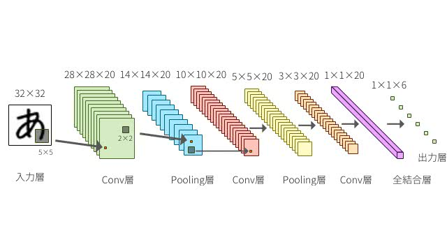
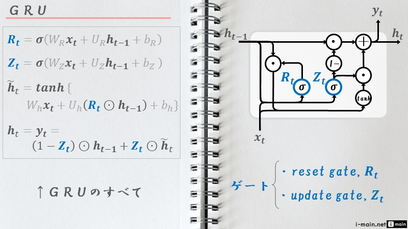
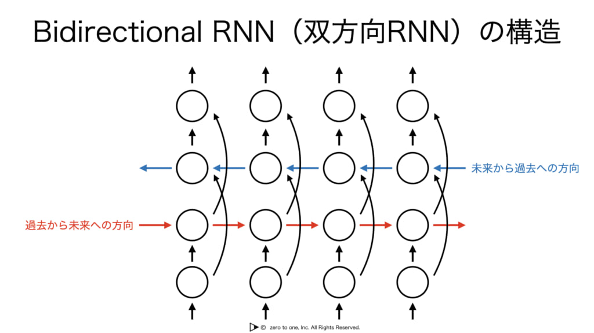
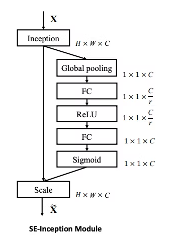
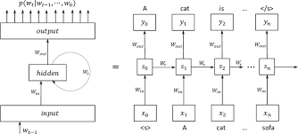
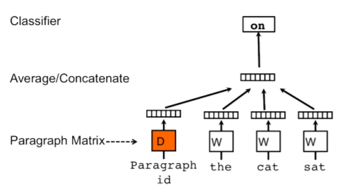
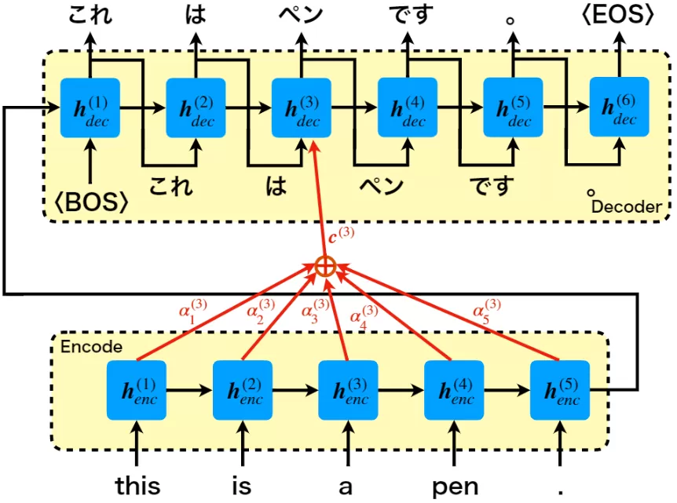

# 進捗報告用資料(4/22~25)

## 東大に行った感想(4/22)

* とりあえず自分の勉強の方向性は少しずれていた。
* 基礎がすべてだと思いこみ、確率論などの問題集を解いたり、統計をやってみたり、  _  _ ディープラーニング以前の手法 _  _  について色々やっていた。
* これは、  _  _ 遠回りすぎる(私の要領的に無理)。 _  _  余裕が出来てきたら、戻ってくる。
* とりあえず、色んな  _  _ ディープラーニング _  _  の手法を学ぶ。

## やったこと(4/22~25)

以上を加味してやったこと。

1. とりあえず基礎に戻ってDenseレイヤー(全結合層)
2. CNN
3. RNN
4. GRU
5. LSTM
6. bi-LSTM
7. SE-block(Attentionぽいもの)
8. RNNLM
9. word2vec
10. doc2vec
11. Attention(初代)
12. 今後の予定(Attentionのより一般的な機構)

以下順を追って概要だけまとめていく。(画像を無断で拾ってきているため、(する価値も無いと思いますが)外部には公開しないでください。)

## Denseレイヤー(全結合層やfc層と呼ばれることも)

入力と出力がすべてつながっている層のこと。入力ベクトル$I$を$i$次元、出力ベクトル$O$を$o$次元とすると

$$
O = W _ {i2o}I
$$

となるためパラメータ数は$i×o$個数となる。つまり線形写像のこと。ただし、一般には定数項も含めて線形とか言ったりする(正確にはアフィン写像)。つまり

$$
O = W _ {io}I + b
$$

ということになる。

$concat$なる演算を以下のように定義する。

$$
concat(X,Y)=(x _ 1,x _ 2,\cdots,x _ n,y _ 1,y _ 2,\cdots,y _ m)^T
$$
要はつなげるだけである。python的にいうなら`X.extend(Y)`である。すると先ほどのアフィン写像は
$$
O = W _ {io}I + b = W _ {i+1o}concat(X,1)
$$
となる。

## CNN

CNNは畳み込み層とプーリング層を持つニューラルネットワークのこと。畳み込み層(Conv層)は特徴量の自動抽出(特徴マップの作成)、プーリング層(Pooling層)は次元圧縮をしている。

畳み込み層は画像処理で言うところフィルタ処理にあたる。

画像のように、カーネルと入力画像で内積を取りその大きさを特徴マップとして出力する。内積を取るということは、カーネルとのパターンが同じような部分は値が大きくなり、そうでない部分は値が小さくなるため特徴抽出として機能する。これに関しては、実際にやってみるのが早い。pythonなどで、ガウシアンフィルタや平滑化フィルタ、x軸フィルタやy軸フィルタを画像にかけて見るとよくわかる。

https://github.com/yukimaru77/pytorch-experiment/blob/master/jupyterLab/work/chapter10.ipynb

## RNN

RNNは過去のデータも考慮して、出力を決めることが出来るアーキテクチャである。画像を数式化する。入力がシーケンシャルデータ(順序に意味のあるデータ)とし、そのt番目のデータを$x^{(t)}$とし、$g _ 1,g _ 2$は活性化関数である。

$$
入力:x^{(t)}
$$

$$
内部状態(隠れ層):a^{(t)}=g _ 1(W _ {ax}x^{(t)}+W _ {aa}a^{(t-1)}+b _ a)
$$

$$
出力y^{(t)}=g _ 2(W _ {ya}a^{(t)}+b _ y)
$$

ただしこのような表記はあまりされず、慣習としてDense層は活性化関数を$g$とし、引数のパラメータを除いたものを$X,Y$とすると
$$g(W _ XX+W _ YY+b):=f^g(X,Y)$$
と表記されるため先ほどのの入力、内部状態、出力は

$$
入力:x^{(t)}
$$

$$
内部状態(隠れ層):a^{(t)}=f^{g _ 1}(x^{(t)},a^{(t-1)})
$$

$$
出力y^{(t)}=f^{g _ 2}(a^{(t)})
$$

ただし、今回の図のアーキテクチャでは先に$a^{(t)}$を計算してから$y^{(t)}$を計算するとなっていたのでその通りにしたが場合によっては$y^{(t)}$から計算する場合もある。つまり
$$
出力y^{(t)}=f^{g _ 2}(x^{(t)},a^{(t-1)})
$$

となっている場合もある。なお、RNNには以下のようなバリエーションがある。右上がエンコーダ、左下がデコーダに対応する。

## GRU

RNNに長期記憶を持たせようとしている。ここで各文字の役割を先に説明しておく。
* $R _ t$はどのくらい忘れるの？という指標
* $Z _ t$はどのくらい新しい情報を使うの？という指標
* $\tilde{h} _ t$は$x _ t$によって追加された情報
* $h _ t$は内部状態

これによってRNNのように単純に内部状態を更新するのではなく、どのくらい更新するのか？という操作が可能になる。

## LSTM

RNNに長期記憶と短期記憶の両方を持たせようとしている。ここで各文字の役割を先に説明しておく。
* $c _ t$は長期記憶
* $h _ t$は短期記憶
* $f _ t$は長期記憶をどのくらい忘れるの？という指標
* $i _ t$は長期記憶にどのくらい新しい情報($\tilde{c} _ t=$前回の短期記憶+現在の入力$x _ t$)を混ぜるの？という指標
* $o _ t$はどのくらい長期記憶から短期記憶にするの？という指標

これによってRNNのように単純に内部状態を更新するのではなく、長期記憶と短期記憶の二つを持つことが可能になった。

## bi-LSTM

LSTMは一方向しかデータを使わなかったのに対し、bi-LSTMは双方向の情報を使っている。

## SE-block

SE _ blockは、各どの特量マップに注目すればいいかを明示的に指定する仕組み。

## RNNLM

RNNを言語モデル(LM)に用いるということ。普通のRNNに見える。なぜ特別な名前が与えられているのかよくわからない。

## word2vec

word2vecとはwordをvectorにするモデルの  _  _ 総称 _  _  。特別に何かを指すわけではない。ちなみに、ベクトルにした単語のことを単語の分散表現と言ったりする。

### CBOW

上記のアーキテクチャとなっている。Hidden layerは平均値をとっている。$W _ {V×N}$は複数個あるが全て同じものを使用している。入力は$C-1$個の単語($X _ {\frac{C}{2}}$が抜けている。)であり、出力は$X _ {\frac{C}{2}}$の予測値の確率分布(Xはone _ hotベクトル)。このタスクを精度よく解くことが出来れば、$W _ {V×N}$のそれぞれの縦ベクトルが、単語の分散表現になっている。

### skip _ gram

上記のアーキテクチャとなっている。CBOWの逆バージョン。ただし、$W _ {N×V}$は全て同じのため当然ながら出力の確率分布はすべて等しくなってしまう。つまりタスクの精度だけを見るとかなり悪い。しかし、真のタスクは単語の分散表現の獲得のため、そんなことはどうだっていい。同じく、$W _ {V×N}$のそれぞれの縦ベクトルが、単語の分散表現になっている。

### 軽量化

最後の出力は確率分布、つまりソフトマックス関数を使用している。しかし、一般にone-hotベクトル何百万次元となることが珍しくないため、シグマの計算が想い。よってhierarchical softmax(100分類×3回=100万回)といった手法や、negative sumplingといった手法で軽くするように努力している。

## doc2vec

doc2vecとはdocumentをvectorにするモデルの総称。

### PV-DM

上記のアーキテクチャになっている。word2vecのCBOWに対応している。タスクは各documentにidを振っておき、$n-1$個の単語からn個目の単語を予測するというタスク。分散表現も同様に、$D$の縦ベクトルがそれぞれの文章に対応する分散表現になっている。

### PV-DBOW

PV-DBOWというskip-gramに対応するものもあるが(本来はPV-DMとPV-DBOWの結果をconcatして一つの出力とする)、PV-DMのみでそこそこいい精度が出るらしく、例えばgensimではデフォルトでPV-DBOWは使わない設定となっている。よってここでは割愛する。

## Attention(初代)

(初代？)Attention機構は以下のような図になる。

この図は、seq2seqなるRNNの図となっている。さらに$h^{(3)} _ dec$におけるAttetionに注目して図示した図である。(本当はすべての場所$h^{(n)} _ dec$に矢印が伸びている。)それを図示したのが以下の図になる。

数式にすると
$$
p(y _ i)=p(y _ i|y _ {i-1},h^{(i)},c^{(i)})
$$

$$
c^{(i)} = \sum  _  jα^{(i)}  _  {j}h^{(j)}  _  {enc}
$$

$α^{(i)} _ {j}$を学習することで、どの入力に対して重みを強くするかを操作することが出来る。