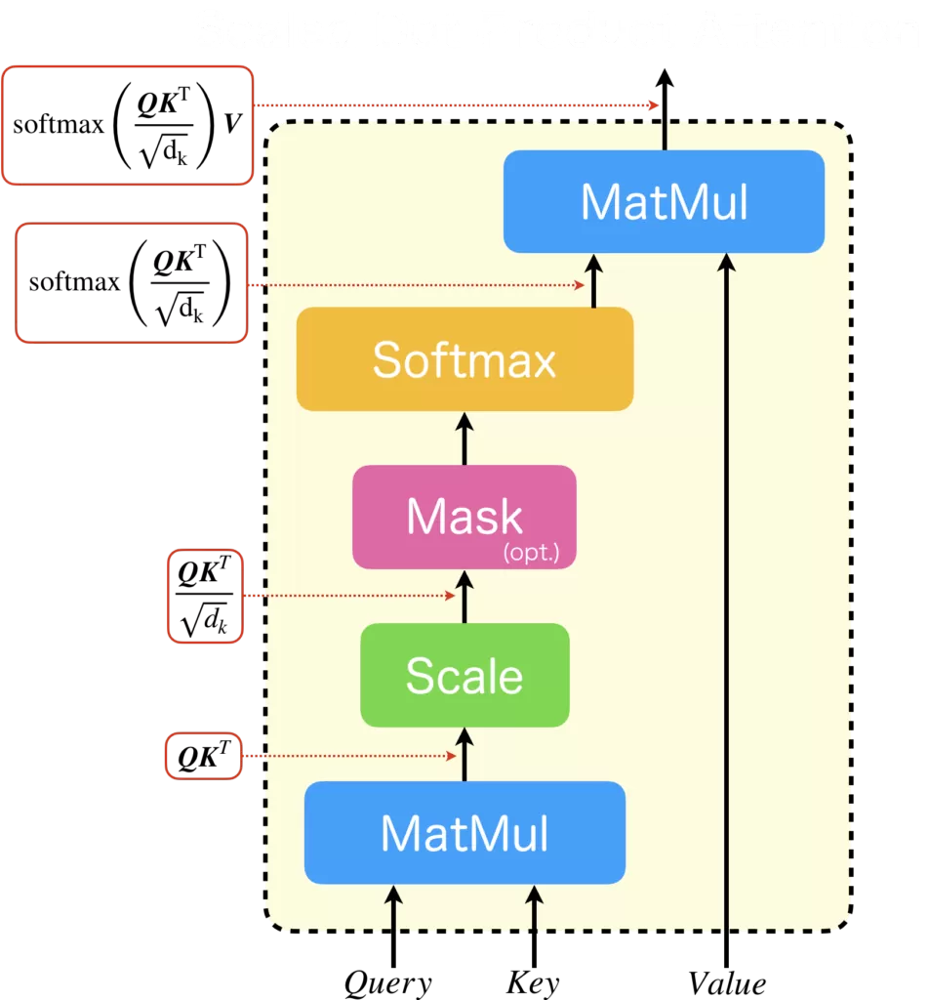
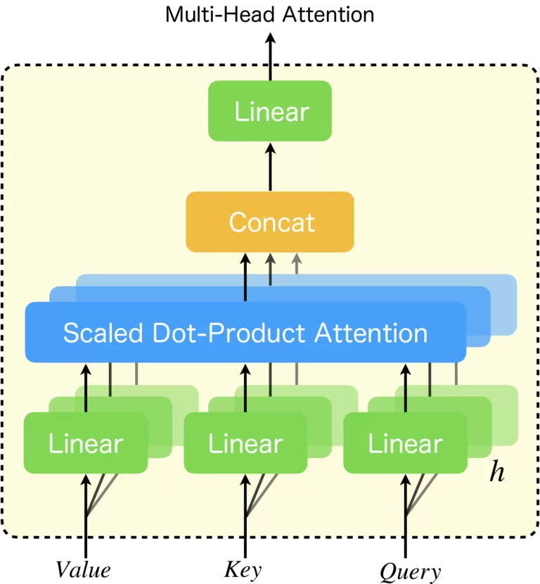

# 進捗報告用資料

## やったこと(4_26~5_2)

1. BEAMsreach
2. GNMT
3. Scaled Dot-Product Attention
4. Multi-Head Attention
  
## Scaled Dot-Product Attention

見ての通りだが、解説していく。まず、Scaled Dot-Product Attentionは学習パラメータを持たない。また、$Query、Key、Value$について(以後Q、K、V)とする。
$$
Q=
\begin{pmatrix} 
\vec{q_1} \cr
\vec{q_2} \cr
\vdots \cr
\vec{q_n} \cr
\end{pmatrix}
$$

$$
k=
\begin{pmatrix} 
\vec{k_1} \cr
\vec{k_2} \cr
\vdots \cr
\vec{q_m} \cr
\end{pmatrix}
$$

$$
V=
\begin{pmatrix} 
\vec{v_1} \cr
\vec{v_2} \cr
\vdots \cr
\vec{v_m} \cr
\end{pmatrix}
$$

となっている。ただしベクトル表記したものはすべて横ベクトルである。(自然言語処理の慣習で縦ベクトルより横ベクトルが使われている。)

例がある方がわかりやすいので、Queryの一つ一つは単語を表すベクトルとする。さらに、これはバッチ処理に過ぎないので、一旦
$$
Q=
\begin{pmatrix} 
\vec{q_1} 
\end{pmatrix}S
$$
として話を進める。すると
$$
Q{}^Tk=
\begin{pmatrix} 
\vec{q_1} {}^T\vec{k_1} & \vec{q_1} {}^T\vec{k_2} & \cdots \vec{q_1} {}^T\vec{k_m} 
\end{pmatrix}
$$
となる。つまりそれぞれの$k$を$q_1$と内積を取っているだけである。ここで内積はcos類似度等の定義からも分かるように類似度を表す。よって$Q{}^Tk$は類似度の横ベクトルとなっている。これを単語ベクトルの次元$d$(つまり$q_1$の次元=$d$)の平方根を取ったモノ$\sqrt d$で割ってスケーリングする。$d$は一般に高次元なので、内積結果も大きくなりシグモイド関数が極端な値(0or1)の値を取りやすくなってしまうため入れている(と思われる)。これを$softmax$してやり、その結果確率分布$P$(横ベクトル)を得ることが出来る。
$$

P=softmax (Q{}^Tk)=softmax
\begin{pmatrix} 
\vec{q_1} {}^T\vec{k_1} & \vec{q_1} {}^T\vec{k_2} & \cdots \vec{q_1} {}^T\vec{k_m} 
\end{pmatrix}
$$
となる。これとVベクトルで行列積(バッチサイズ=1だと内積)を取って
$$
PV = \sum_{i=1}^m p_iv_i
$$
つまり重み付きのvの加算となる。一般のqの場合もこの処理をそれぞれの列で行っているに過ぎない。

まとめると、
* Qは問い合わせ内容。
* Kはvalueの鍵。問い合わせ内容がどの程度一致するのか。
* Vはvalue。鍵と適合した場合使う値。

## Multi-Head Attention

## 